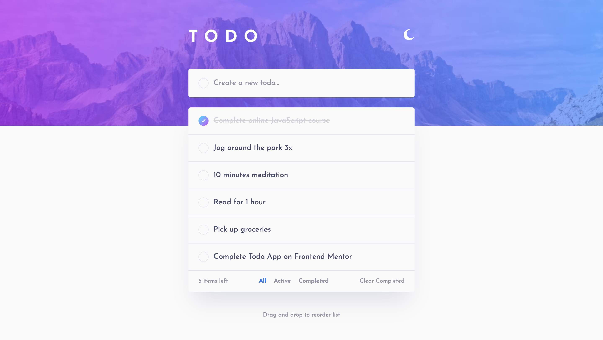
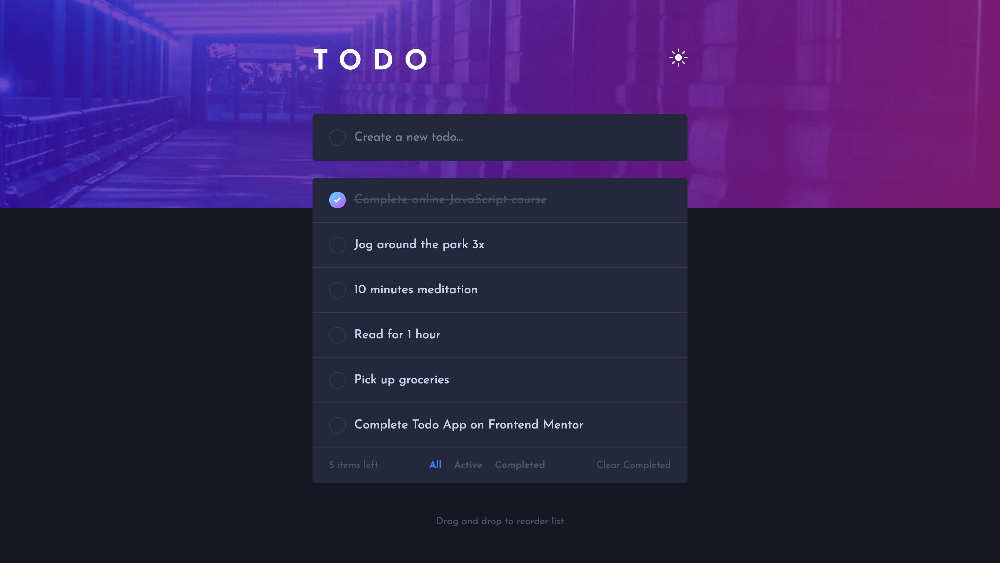
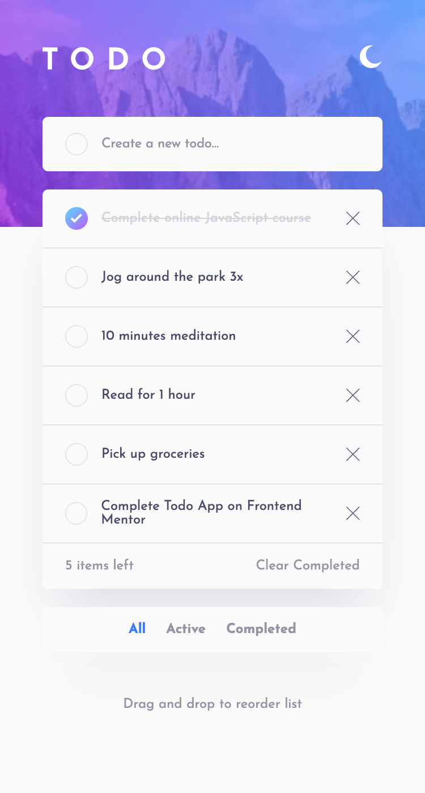
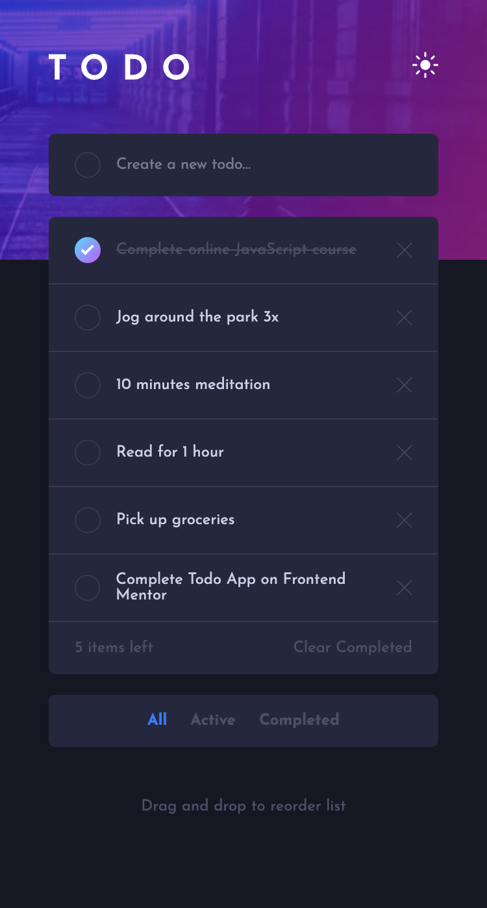

React Example Todo Application
==============================

[](https://reactjs.org/)

React example ToDo Application with user authentication.


### Stack:
- React.js
- Styled Components
- React Router
- Redux Toolkit


The challenge
-------------

Users should be able to:

- View the optimal layout for the app depending on their device's screen size
- See hover states for all interactive elements on the page
- Add new todos to the list
- Mark todos as complete
- Delete todos from the list
- Filter by all/active/complete todos
- Clear all completed todos
- Toggle light and dark mode

### Screenshots

Desktop Light Theme

<p float="left">
  
</p>

Desktop Dark Theme

<p float="left">
  
</p>

Mobile Light Theme

<p float="left">
  
</p>

Mobile Dark Theme

<p float="left">
  
</p>

Configuration
--------------

Replace `.env.example` with real `.env`, changing placeholders

```
REACT_BASE_API_URL=http://localhost:5000
```
